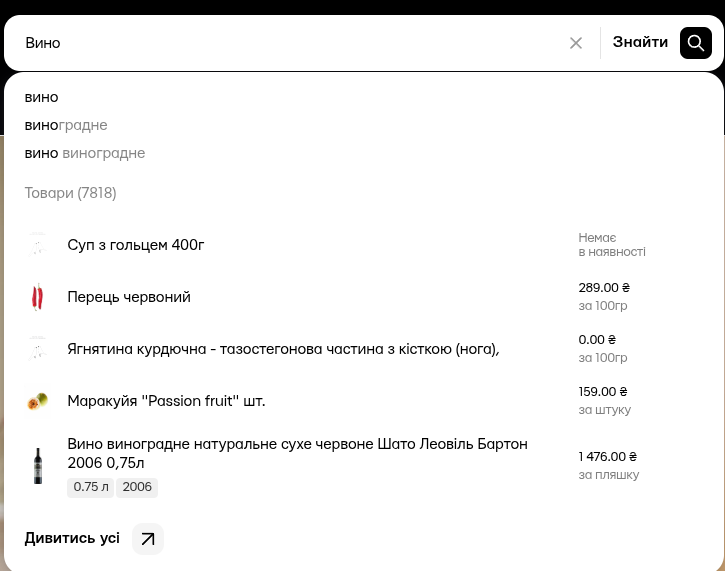
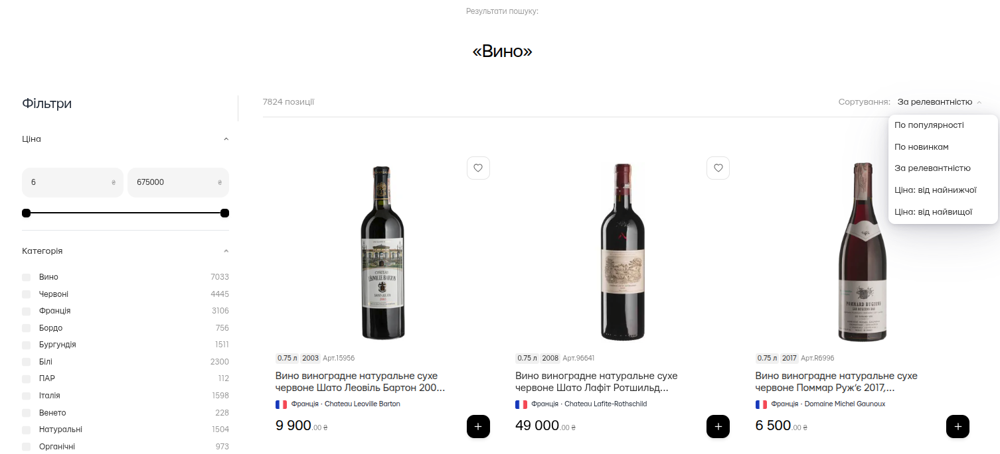
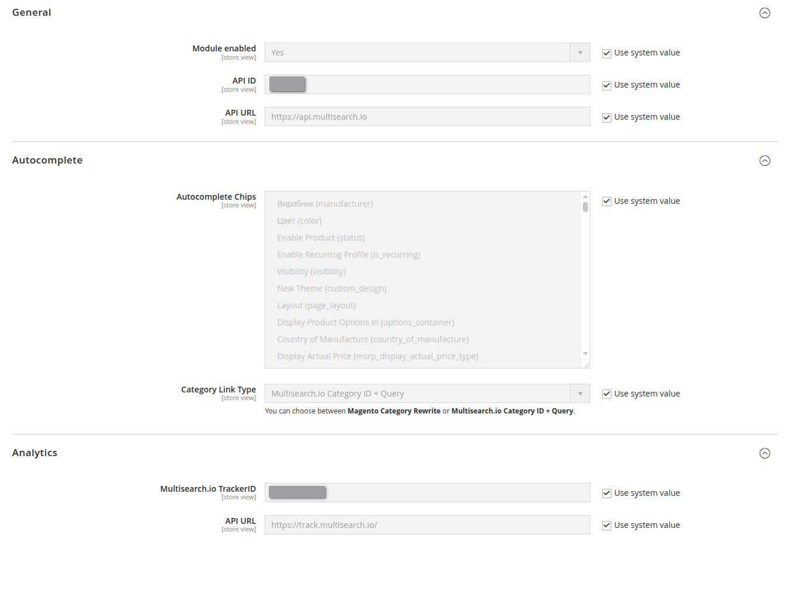

# Інтеграція з Multisearch.io для Magento 2

Цей модуль замінює стандартний пошук Magento 2 на швидкий та функціональний пошук від [Multisearch.io](https://multisearch.io/).
Інструкції з встановлення можна знайти в файлі [INSTALL.md](INSTALL.md).

## Основні можливості

### Автозаповнення (Autocomplete)

*   Надає миттєві та релевантні пропозиції під час введення запиту в полі пошуку.
*   Відображає товари, категорії та популярні запити безпосередньо у випадаючому вікні пошуку.
*   Гнучке налаштування вигляду та вмісту блоку автозаповнення.

### Сторінка результатів пошуку

*   Повністю замінює стандартну сторінку пошуку Magento.
*   Використовує потужний рушій Multisearch для швидкого отримання результатів.
*   Підтримує повноцінну навігацію (фільтрацію) за атрибутами товарів, категоріями та ціною.

### Фільтрація (Layered Navigation)

*   Дозволяє покупцям легко уточнювати результати пошуку за допомогою фільтрів.
*   Підтримка фільтрації за будь-якими атрибутами товарів (наприклад, колір, розмір, бренд).
*   Фільтрація за категоріями та діапазоном цін.

### Аналітика

*   Збирає дані про пошукові запити та поведінку користувачів.
*   Допомагає аналізувати популярні запити, запити без результатів та ефективність пошуку загалом.
*   Інтеграція з аналітичною панеллю Multisearch.io.

### Адміністративна панель

*   Дозволяє легко налаштувати всі аспекти роботи модуля без необхідності втручання в код.
*   Керування параметрами підключення до сервісу Multisearch.io.
*   Налаштування атрибутів для фільтрації та відображення.

### Продуктивність

*   Використовує кешування для прискорення завантаження результатів пошуку та фільтрів.
*   Зменшує навантаження на сервер Magento, оскільки основні обчислення відбуваються на стороні Multisearch.io.

